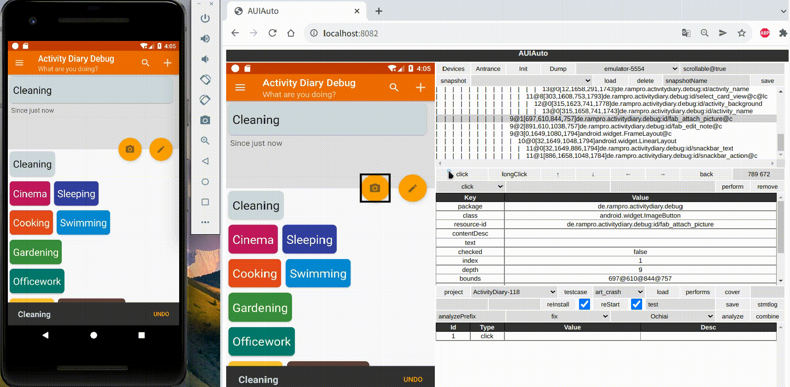
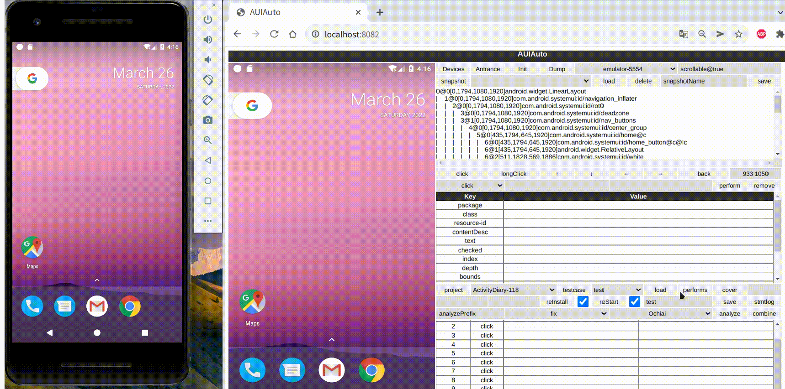
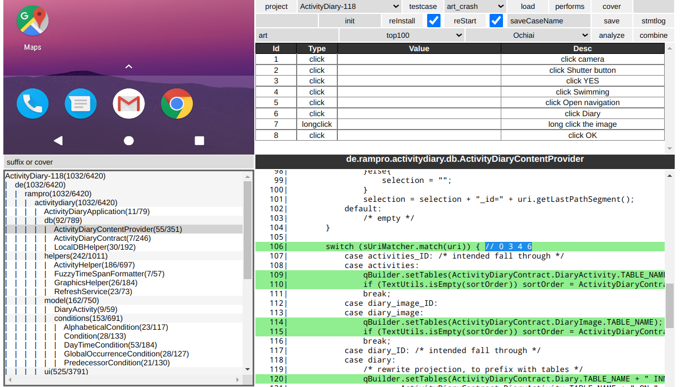
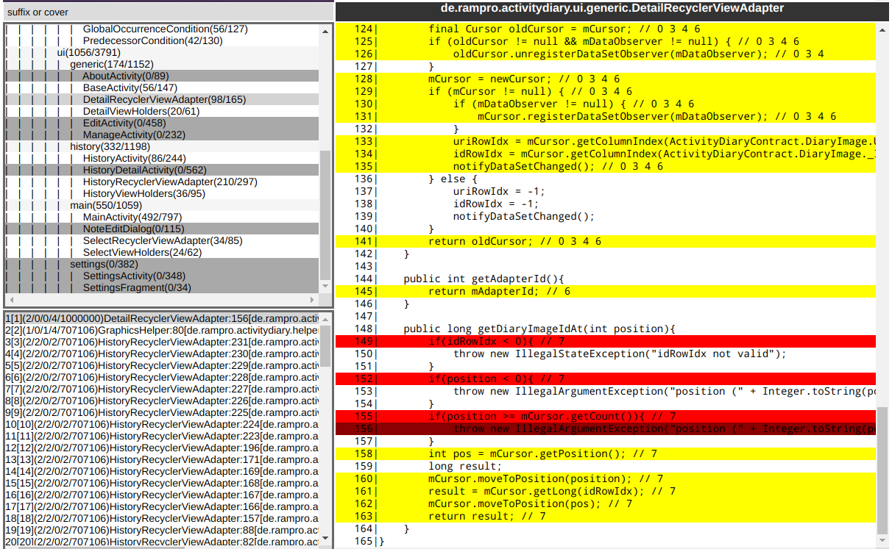
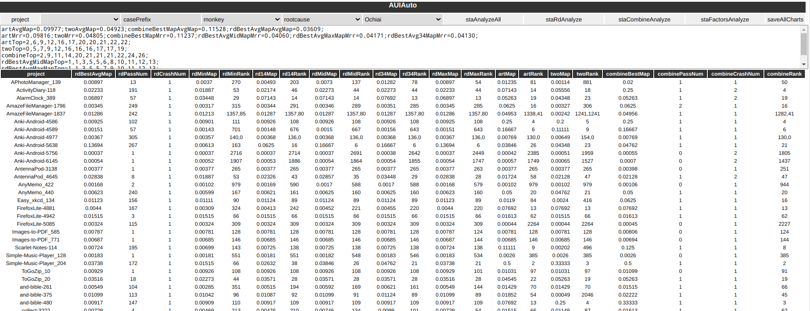
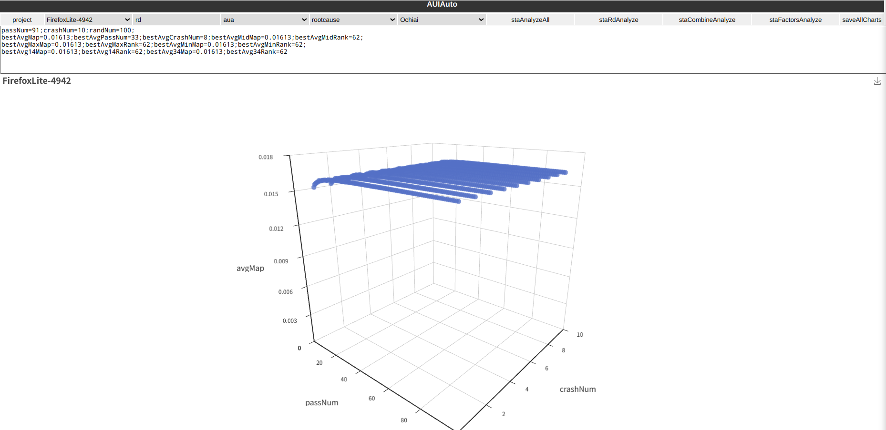
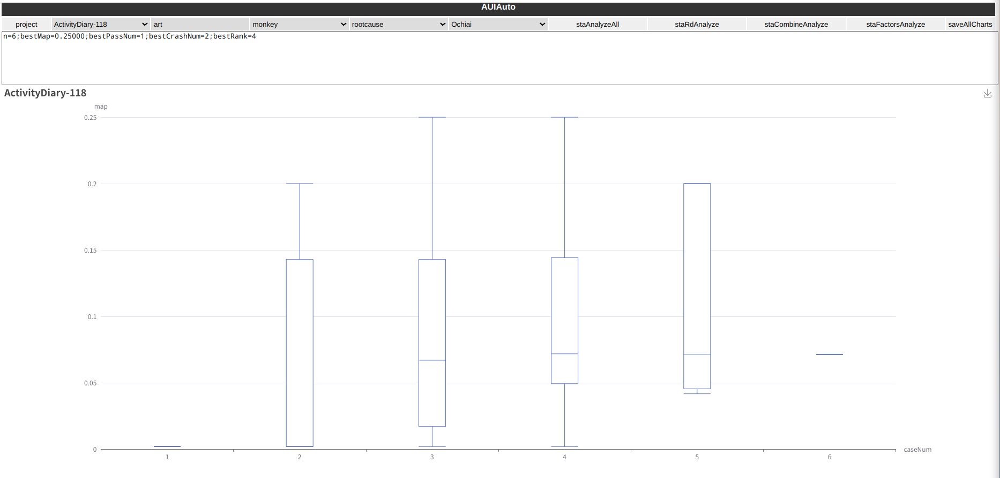

# auiauto

## 简介

开发中...

auiauto是一款android缺陷定位工具. 用户可借助auiauto录制测试用例, 复现测试用例获取代码覆盖率, 对比正确用例与错误用例之间的覆盖率差异来定位可疑语句, 从而帮助开发者寻找引发崩溃的根本原因. 

**auiauto目前只对linux做了适配.**

接下来通过一个例子简单介绍auiauto的功能:

1. 首先录制一个测试用例. 这里我们采用一个会使程序崩溃的用例进行演示:



> 演示视频:https://github.com/Zongyin-Hao/auiauto/tree/main/doc/ExampleGIF/Example1
>
> doc/ExampleGIF/Example1

2. 接着加载刚刚录制的用例, 进行用例复现:



> 演示视频:https://github.com/Zongyin-Hao/auiauto/tree/main/doc/ExampleGIF/Example2
>
> doc/ExampleGIF/Example2

3. 复现结束后就可以查看这个用例的覆盖率信息了. 覆盖语句后面会用注释显示覆盖这条语句的动作id. 另外, 可以通过设置cover参数查看每一步动作的覆盖率



> 演示视频:https://github.com/Zongyin-Hao/auiauto/tree/main/doc/ExampleGIF/Example3
>
> doc/ExampleGIF/Example3

4. 假设目前已经录制好了若干以` art_`开头的测试用例, 可以通过点击`analyze`进行差异分析, 显示可疑语句:



> 演示视频: https://github.com/Zongyin-Hao/auiauto/tree/main/doc/ExampleGIF/Example4
>
> doc/ExampleGIF/Example4

5. 实验结果统计对比(需要访问/sta):







另外, auiauto的各个模块目前是可以并行执行的, 但要满足一个模拟器上只对一个app进行操作.

## 编译

首先配置golang环境, 我们使用的golang版本为1.15.2. 国内用户推荐配置一下代理:

```
go env -w GOPROXY=https://goproxy.cn,direct
```

接着运行auiauto根目录下的build.sh:

```
./build.sh
```

此时根目录下会生成auiauto可执行文件, 编译成功

## 运行

配置根目录下的config.json:

```json
{
  "adb": "adb命令路径, 可以用whereis adb查看",
  "avd": "avd路径, 一般情况是~/.android/avd",
  "database": "database路径, 一般./database就可以",
  "ip": "后端服务ip, 可以直接写0.0.0.0",
  "port": "后端服务端口, 默认8082"
}
```

接下来运行编译生成的auiauto可执行文件:

```
./auiauto
```

现在在浏览器中访问 (http://localhost:8082/) 就可以正常使用了(ip和端口是config.json中配置的, 用户自行调整):


## DroidFL

如果想要查看DroidFL的实验结果, 可以下载我们提供的projects文件:

https://mega.nz/file/x0cG1JqT#MPImH8kRrmwfd1ojBJvaOlDqpRVcPMNN1StYvRpD_lU

链接失效的话issue提醒我们, 后面我们也会尽量搭个服务器提供数据下载.

## 用户文档

> doc/User

正在完善, 这期间有需要的话可以去issue提问

## 开发者文档

> doc/Developer

正在完善, 这期间有需要的话可以去issue提问, 也可以看源码注释, 源码注释还是比较清晰的
